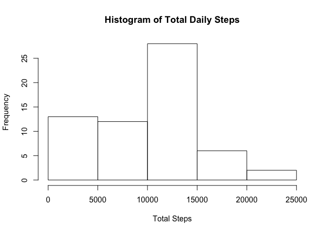
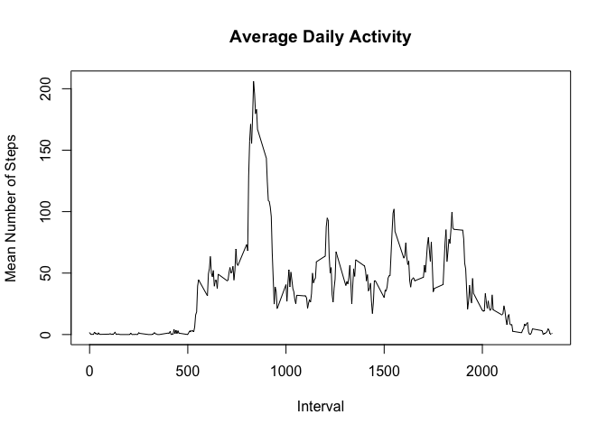
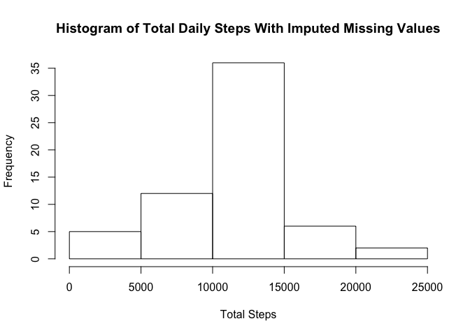
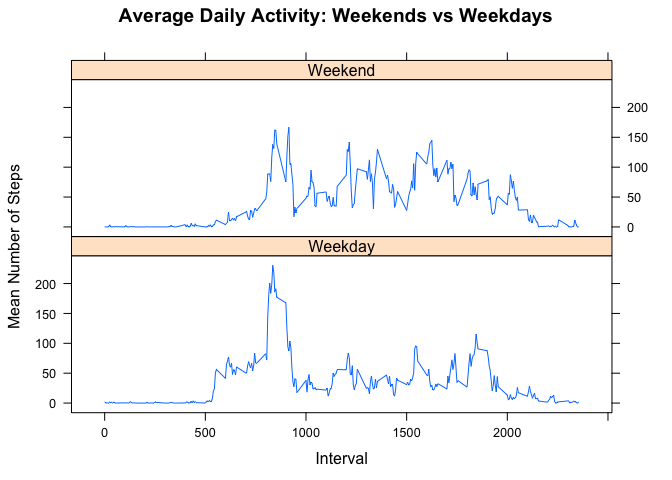

# Reproducible Research: Peer Assessment 1
Eric Jackson  


## Loading and preprocessing the data
Unzip the data file, read it, and create a new data frame with dates in the proper format. Clean up by removing the unzipped file.


```r
unzip("./activity.zip")
a <- read.csv("./activity.csv", header=TRUE, na.strings="NA")
a <- data.frame(steps=a$steps, date=as.Date(a$date), interval=a$interval)
unlink("./activity.csv")
```

## What is mean total number of steps taken per day?
We aggregate steps by day and plot a histogram of the totals.


```r
total.per.day <- aggregate(a$steps, by=list(date=a$date), FUN=sum, na.rm = TRUE)
names(total.per.day) <- c("date", "steps")
hist(total.per.day$steps, freq=TRUE, main="Histogram of Total Daily Steps", xlab="Total Steps")
```

<!-- -->

Now we calculate the mean and median, rounding to the nearest integer.


```r
mean.steps.per.day <- round(mean(total.per.day$steps),digits=0)
median.steps.per.day <- round(median(total.per.day$steps))
```

The mean total number of steps taken per day is 9354, and the median is 10395.

## What is the average daily activity pattern?

To determine the average daily pattern, we aggregate the average number of steps by interval and plot it as a time series.


```r
mean.per.interval <- aggregate(a$steps,
                               by=list(interval=a$interval),
                               FUN=mean, na.rm = TRUE)
names(mean.per.interval) <- c("interval", "steps")
plot(mean.per.interval$interval, mean.per.interval$steps, type="l",
     xlab="Interval", ylab="Mean Number of Steps", 
     main="Average Daily Activity")
```

<!-- -->

Not surprisingly, activity is concentrated in the daytime and early evening hours. The subject has an especially high peak in the morning. Let's calculate the specific interval in which the maximum appears and the corresponding time.


```r
index = which.max(mean.per.interval$steps)
max.interval = mean.per.interval$interval[index]
hour = trunc(max.interval/100)
min = max.interval - hour*100
if (hour < 12) {
    ampm = "AM"
} else {
    if (hour > 12) {
        hour = hour - 12
    }
    ampm = "PM"
}
```

The interval containing the maximum number of steps, on average, is interval 835, i.e., around 8:35 AM.

## Imputing missing values

We'll replace the 2304 missing values in the original dataset with the mean number of steps for that interval and then re-plot the histogram of daily steps on the new dataset


```r
steps2 <- rep(0, length(a$steps));
for (i in 1:length(a$steps)) {
  if (is.na(a$steps[i])) {
    # Compute the index of the interval
    hr = trunc(a$interval[i]/100)
    min = a$interval[i] - 100*hr
    idx = hr * 12 + min/5 + 1
    # And set to corresponding mean
    steps2[i] = mean.per.interval$steps[idx]
  }
  else {
    steps2[i] = a$steps[i]
  }
}
# Create the new dataset
a.imp <- data.frame(steps=steps2, date = a$date, interval = a$interval)

# Now aggregate and plot the histogram
total.per.day <- aggregate(a.imp$steps, by=list(date=a.imp$date), FUN=sum, na.rm = TRUE)
names(total.per.day) <- c("date", "steps")
hist(total.per.day$steps, freq=TRUE, main="Histogram of Total Daily Steps With Imputed Missing Values", xlab="Total Steps")
```

<!-- -->

Now calculate the new mean and median (again rounding to the nearest integer).


```r
mean.steps.per.day <- round(mean(total.per.day$steps))
median.steps.per.day <- round(median(total.per.day$steps))
```

This method of imputing missing values noticeably changes the distribution. There is a significant increase in the probability of step counts in the 10,000 - 15,000 range, which shifts the mean and median up, coincidentally making them match: the mean total number of steps taken per day is 10766, and the median is also 10766.

## Are there differences in activity patterns between weekdays and weekends?

Now we investigate the differences in activity on weekdays and weekends. Using the dataset from the previous set, we add a factor variable indicating whether the observation occurred on a weekend or weekday.


```r
a.imp$daytype <- factor(ifelse (weekdays(a.imp$date) %in% c("Saturday", "Sunday"),"Weekend","Weekday"))
```

Now we recompute the mean-per-interval:


```r
mean.per.interval <- aggregate(a.imp$steps,
                               by=list(interval=a.imp$interval, daytype=a.imp$daytype),
                               FUN=mean)
names(mean.per.interval) <- c("interval", "daytype", "steps")
```

Finally, we present a panel plot of the mean total steps per interval on weekends and weekdays:


```r
library(lattice)
xyplot(steps ~ interval | daytype, data = mean.per.interval, type="l", layout = c(1, 2),
       xlab="Interval", ylab="Mean Number of Steps",
       main="Average Daily Activity: Weekends vs Weekdays")
```

<!-- -->

As may be seen in the plot, the subject is more active throughout the day on weekends.

## Note on interpolated values

The two sets of mean/median values and the peak activity interval and time above are interpolated into the text using the `backtick-r ... backtick`. This may be seen in the `PA1_template.Rmd` file).


